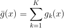

# Bias Variance Experiment

Problem 2.24, p. 75.

For each final hypotheisis g1, g2, ..., gk estimate the average hypothesis for any x by:  
<a href="https://www.codecogs.com/eqnedit.php?latex=\bar{g}(x)&space;=&space;\sum_{k=1}^{K}g_{k}(x)" target="_blank"></a>


## Installation

See https://pipenv.readthedocs.io/en/latest/install/#installing-pipenv to install *pipenv*, if you do not have it.

## Usage

**To run this program:**
```
pipenv run python main.py
```

## Credits
- Abu-Mostafa, Yaser S. *Learning from Data: a Short Course*. AMLBooks, 2012.